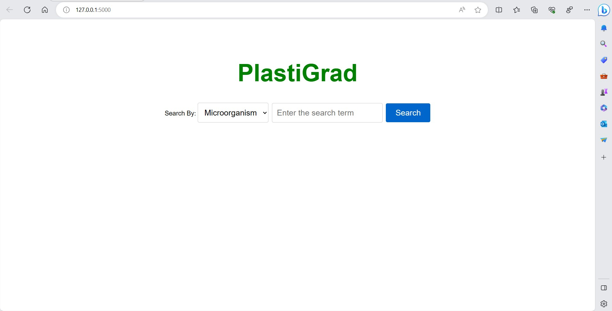

# PlasticGrad Web App

This Python web application, named "PlasticGrad," provides detailed information about plastic degraders based on different search options. Users can search for degraders by Microorganism, Plastic, or Enzyme and view relevant information in a tabular format.


## Project Overview

The Plastic Degraders Information Web App is built using Python and Flask, making it easy to search for specific degraders based on user-defined criteria. It utilizes a TSV (Tab-Separated Values) file containing data about plastic degraders, which is loaded and displayed to the user.

## Features

- Search for plastic degraders by Microorganism, Plastic, or Enzyme.
- Dynamic filtering of data based on user input.
- Clean and user-friendly interface.

## Installation

To run this web application locally, follow these steps:

1. Clone this repository to your local machine.

```bash
git clone https://github.com/yourusername/plastic-degraders-app.git
cd plastic-degraders-app
```

2. Install the required Python packages using pip.
```bash
pip install flask
```

3. Run the application.
```bash
python app.py
```
The web app will be accessible at http://localhost:5000 in your web browser.
## Screenshots
* Homepage.


* Dropdown:


* Table:


## Usage
Access the Plastic Degraders web app in your web browser.
Choose a search option from the dropdown menu (Microorganism, Plastic, or Enzyme).
Enter your search term in the input field.
Click the "Search" button.
The application will display a table with the relevant information based on your search criteria.

## Technology Stack


## Project Structure
The project directory structure is as follows:
```bash
plastic-degraders-app/
│
├── app.py
├── degraders_list.tsv
├── templates/
│   └── degraders.html
└── README.md
```
* app.py: The main Flask application file.
* degraders_list.tsv: The TSV file containing plastic degraders data.
* templates/degraders.html: The HTML template for rendering the web page.

## Authors

- [@Shubham Singh](https://github.com/Shubham722-227)


## License

[](https://choosealicense.com/licenses/mit/)

